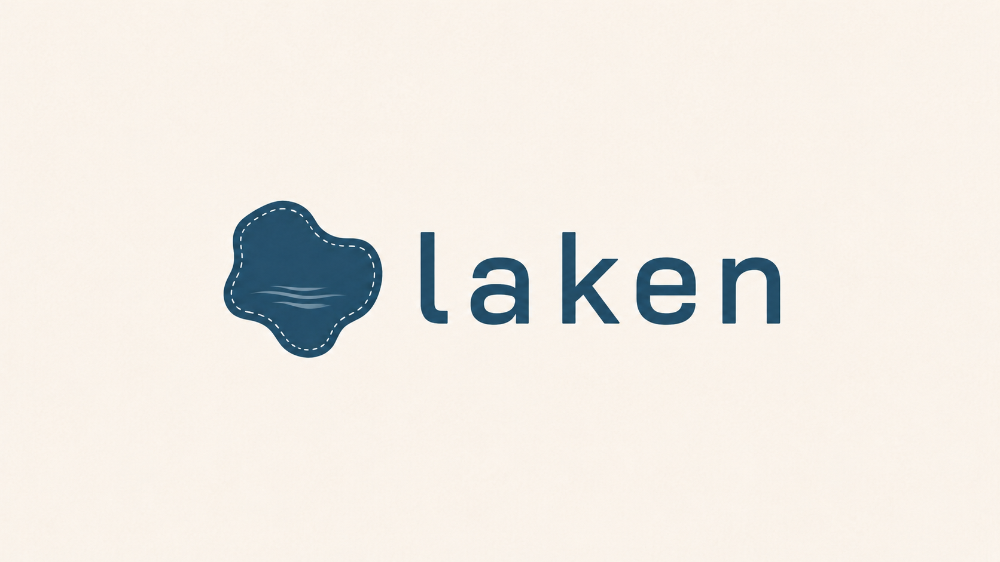

<div align="center">



**The missing local development workflow for Microsoft Fabric.**

</div>

**laken** lets you develop Python code for Fabric locally, using the tools you already trust.

Write code on your machine, run it against real Fabric lakehouse data.

When you're ready, `laken deploy` packages your project, publishes it to Fabric, and makes it
available to your Fabric notebooks.

Your code stays modular. Your notebooks stay thin. And your local workflow survives contact
with the platform.

## Why “laken”?

*Laken*, pronounced **LAH-kuhn**, is Dutch for “cloth.” If you're feeling generous, it's a pun
on Fabric and data lakes.

---

## Installation

Install [uv](https://docs.astral.sh/uv/getting-started/installation/) if needed, then add
`laken`:

```bash
uv add laken
```

```bash
pip install laken
```

Deploy uses [uv](https://docs.astral.sh/uv/getting-started/installation/) to build your
wheel before publishing to a Fabric environment.

---

## Quickstart

Write lakehouse code on your laptop against real Fabric data, package it, and run the
same code in a notebook.

**1. Credentials** — create a `.env` in your project root (see
[Environment variables](#environment-variables) for the full list):

```env
AZURE_TENANT_ID=...
AZURE_CLIENT_ID=...
AZURE_CLIENT_SECRET=...
FABRIC_WORKSPACE_NAME=MyWorkspace
FABRIC_LAKEHOUSE_NAME=MyLakehouse
FABRIC_WORKSPACE_ID=...
FABRIC_LAKEHOUSE_ID=...
```

**2. Develop** — reads pull from Fabric and cache locally. In a Fabric notebook that same
code runs against your attached lakehouse:

```python
from laken import Lakehouse

lh = Lakehouse()
df = lh.read_table("customers", frame_type="pandas")
# ...
lh.write_table(df, "customer_analytics")
```

**3. Package and deploy** — move that code into a normal Python package and publish it to
a Fabric Environment (`FABRIC_ENVIRONMENT_ID` in `.env`):

```
customer_analytics/
├── pyproject.toml
└── src/customer_analytics/
    └── pipeline.py
```

```python
# src/customer_analytics/pipeline.py
from laken import Lakehouse


def create_analytics(lh: Lakehouse) -> None:
    df = lh.read_table("customers", frame_type="pandas")
    # ...
    lh.write_table(df, "customer_analytics")
```

```bash
laken deploy
```

**4. Run in a Fabric notebook** — after the publish finishes:

```python
from laken import Lakehouse
from customer_analytics.pipeline import create_analytics

lh = Lakehouse()
create_analytics(lh)
```

---

## Usage

### `Lakehouse`

`Lakehouse()` detects whether your code is running on your laptop or in a Fabric
notebook and connects accordingly. The same `read_table` / `write_table` calls work in
both places:

- **On your laptop** — the first read of a Fabric table copies it into a `.laken/`
  folder on disk; later reads use that copy. Writes update only your local copy; they do
  not change tables in Fabric.
- **In a Fabric notebook** — reads and writes go to your attached lakehouse.

```python
from laken import Lakehouse

lh = Lakehouse()
```

Use `schema.table` when you need a schema (`marketing.products`). A bare name
(`products`) is resolved by Fabric/Spark, usually as `dbo.products` on a schema-enabled
lakehouse.

```python
df = lh.read_table("products")                         # pandas on your laptop; Spark in Fabric
df = lh.read_table("products", frame_type="spark")
df = lh.read_table("marketing.products", frame_type="polars")

lh.write_table(df, "products")
lh.write_table(df, "marketing.products", mode="append")
```

`write_table` replaces a table by default; pass `mode="append"` to add rows.

To use a different lakehouse than your `.env` or notebook default:

```python
lh = Lakehouse(lakehouse="Sales_LH")
```

### Fabric tables on your laptop

The first time you `read_table` a Fabric table on your laptop, laken downloads a copy
into `.laken/`. Later reads use that copy until you refresh it.

Tables up to **100 MB** in Fabric are copied in full. Larger tables copy only the first
**10,000 rows** — enough to develop against without downloading the whole table.

```python
lh = Lakehouse(max_mirror_mb=200, max_sample_rows=5_000)
lh.read_table("dbo.big_fact", max_mirror_mb=500)
```

Limits on `Lakehouse(...)` also apply to `laken refresh` and `laken reset`. Limits on a
single `read_table` call apply only the first time that table is downloaded.

If a table changes in Fabric after you copied it, laken warns you and keeps using your
local copy. Run `laken refresh <table>` to download the latest data, or `laken reset
<table>` to discard local edits and re-download from Fabric.

### CLI

```text
laken deploy [--workspace-id <id>] [--environment-id <id>]
laken refresh <table>
laken reset <table>
```

`laken deploy` builds your project wheel from `pyproject.toml`, uploads it to a Fabric
Environment, and starts a publish. Fabric rebuilds the environment in the background;
import your package once that finishes. You need a standard Python package layout and a
Fabric environment with a compatible Python/Spark runtime.

`laken refresh <table>` downloads the table again from Fabric. `laken reset <table>`
drops your local copy and downloads a fresh one. Both commands only affect tables that
came from Fabric; tables you created locally are left alone.

### Environment variables

When you create a `Lakehouse` or run a `laken` command, laken loads a `.env` file from
your project root. Variables already set in your shell or CI take precedence. Call
`load_environment()` yourself only if you need those values earlier.

| Variable | Purpose |
| :--- | :--- |
| `AZURE_TENANT_ID` | Auth (fetch + deploy) |
| `AZURE_CLIENT_ID` | Auth (fetch + deploy) |
| `AZURE_CLIENT_SECRET` | Auth (fetch + deploy) |
| `FABRIC_WORKSPACE_NAME` | Local Fabric fetch (all four name/ID vars required) |
| `FABRIC_LAKEHOUSE_NAME` | Local Fabric fetch |
| `FABRIC_WORKSPACE_ID` | OneLake paths; required for deploy |
| `FABRIC_LAKEHOUSE_ID` | OneLake paths; required for local Fabric fetch |
| `FABRIC_ENVIRONMENT_ID` | Deploy target |

`AZURE_*` values come from an Azure service principal. In a Fabric notebook you can copy
the Fabric variables from context:

```python
import notebookutils

context = notebookutils.runtime.context

FABRIC_WORKSPACE_NAME = context['currentWorkspaceName']
FABRIC_LAKEHOUSE_NAME = context.get('defaultLakehouseName')
FABRIC_WORKSPACE_ID = context['currentWorkspaceId']
FABRIC_LAKEHOUSE_ID = context.get('defaultLakehouseId')
FABRIC_ENVIRONMENT_ID = context.get('environmentId')

print(f"FABRIC_WORKSPACE_NAME={FABRIC_WORKSPACE_NAME}")
print(f"FABRIC_LAKEHOUSE_NAME={FABRIC_LAKEHOUSE_NAME}")
print(f"FABRIC_WORKSPACE_ID={FABRIC_WORKSPACE_ID}")
print(f"FABRIC_LAKEHOUSE_ID={FABRIC_LAKEHOUSE_ID}")
print(f"FABRIC_ENVIRONMENT_ID={FABRIC_ENVIRONMENT_ID}")
```

### Logging

laken logs to stderr when you use `Lakehouse` or the CLI. Default level is INFO. To see
more detail:

```python
import logging

logging.getLogger("laken").setLevel(logging.DEBUG)
```

---

## Development

Contributions are welcome. To work on this package:

```bash
uv sync
uv run pytest
uv run ruff check
```
